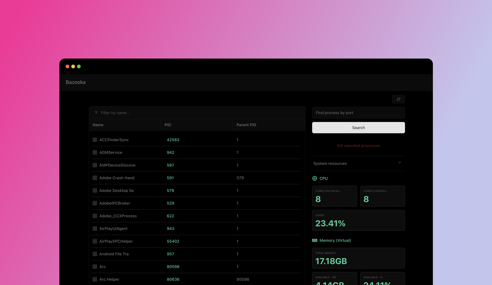

# Bazooka 💣

> STATUS: I am currently writing components for a rewrite under a new name (`Spectre`) into a desktop app (will also be available as a CLI; and definitely still a web app after for convenience), until then, development has halted for this version and package. I will open up the new version soon when it is ready but you can find core components like [tpmu](https://github.com/aosasona/tpmu) that I am still working on. I still use this often so I try to work on the new version when I can but I do not have a lot of time these days.



Bazooka is a simple tool in Go to find and kill processes on your machine by name or port. It provides a Web UI to view, find and kill processes without having to use the command line all in one binary.

# Installation

## Homebrew

You can install Bazooka using Homebrew:

```bash
brew tap aosasona/bazooka
brew install bazooka
```

## Download

Download the latest release from the [releases page](https://github.com/aosasona/bazooka/releases) and extract the zip file. Run the executable file to start the application or run it from the command line like so:

```bash
cd bazooka && ./bazooka --port=8080
```
## Docker
> According to the Docker documentation: `The host networking driver only works on Linux hosts, and is not supported on Docker Desktop for Mac, Docker Desktop for Windows, or Docker EE for Windows Server. So this image is only guaranteed to work on Linux servers/machines.`

Use this command to run the latest version of Bazooka image using Docker in detached mode (obviously). Replace `-d` with `-it` to see logs in real-time (quitting this will also stop the program)
```bash
docker pull trulyao/bazooka@latest # optional
docker run -d --pid=host --net=host trulyao/bazooka@latest
```

## Build from source

You can also build the application from source by cloning the repository to your machine and running the following Make command:

```bash
make build
```

This will create a `bazooka` executable file in the `/build` directory. You can run this file to start the application.

# Usage

Run the application with the following command:

```bash
bazooka -port 8080
```

> By default, Bazooka runs on port 22000. You can change this by passing the `-port` flag.

Once the application is running, you can access the Web UI by visiting `http://localhost:22000` in your browser. You can also change the port by passing the `--port` flag when starting the application.

> NOTE: Bazooka requires root access to kill or even find some processes. You will be prompted for your password when you try to kill a process, you can also run the application with `sudo` to avoid this prompt.

## Contributing 🔖

If you find any bugs or have any suggestions, please feel free to open an issue or submit a pull request. To see other things I intend to ship for this, check out the [issues](https://github.com/aosasona/bazooka/issues) page.
